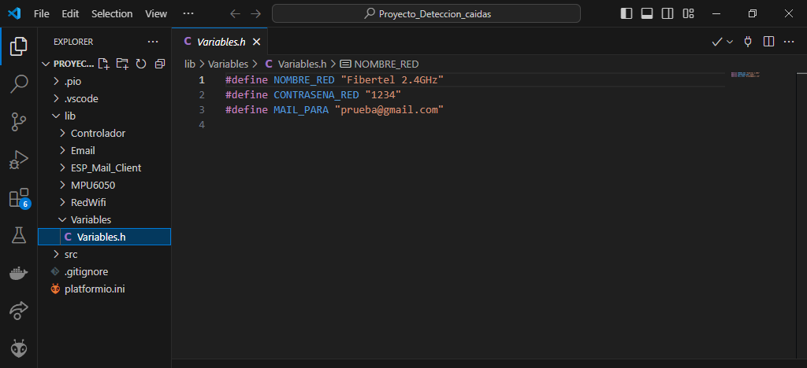
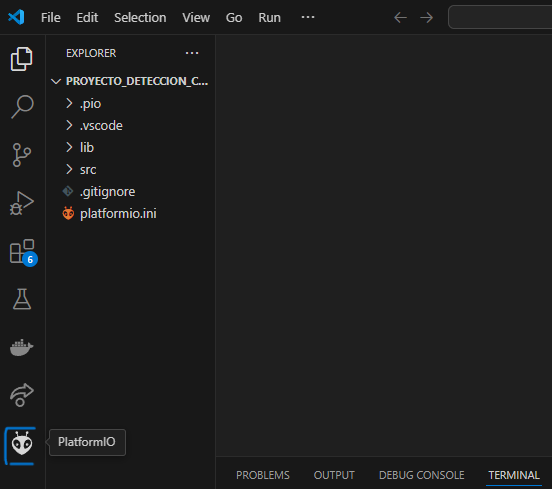
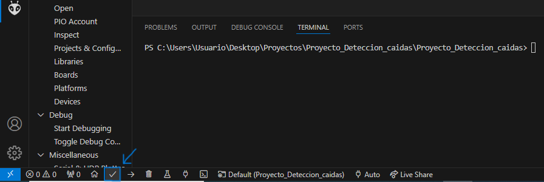
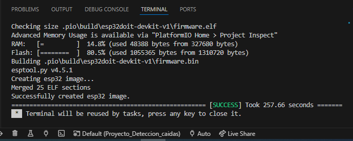
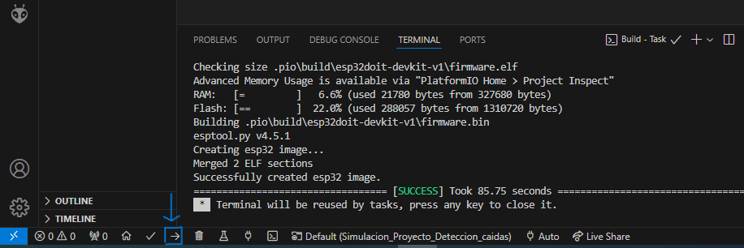
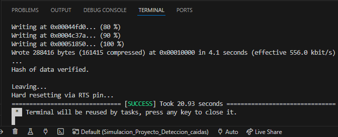
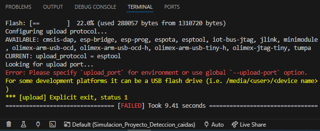
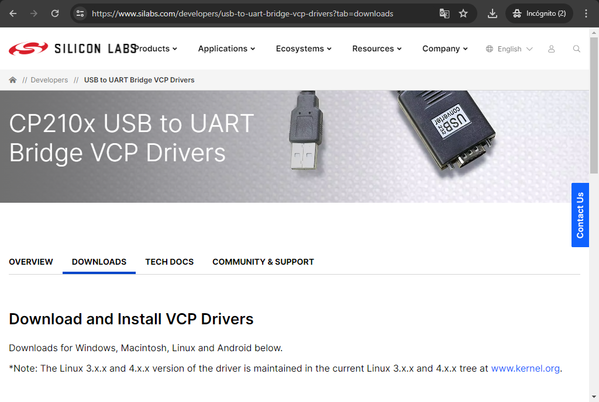
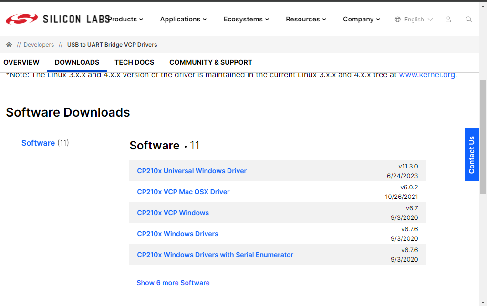
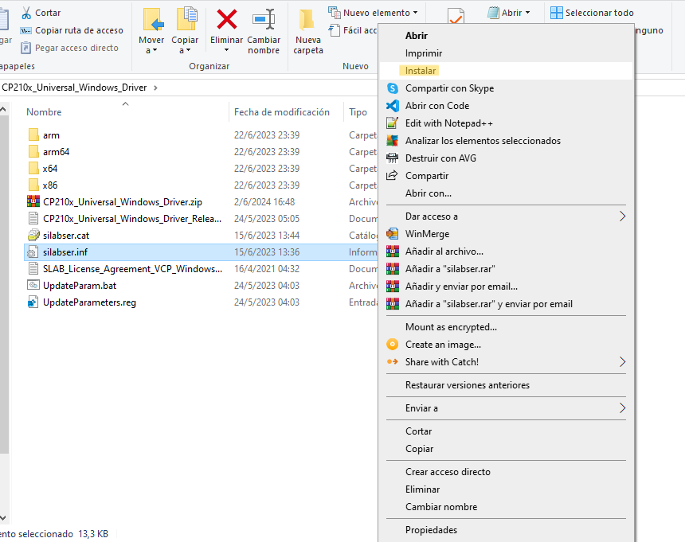

# Sistema de detección de caídas para cuidado de adultos mayores

**Índice**
- [Proyecto Detección de caídas](#proyecto-detección-de-caídas)
    - [Contenido del programa](#contenido)
        - [Main.cpp](#main)
        - [Controlador](#controlador)
        - [Email](#email)
        - [ESP_Mail_Client](#esp-mail-client)
        - [MPU6050](#mpu6050)
        - [RedWifi](#redwifi)
        - [Variables](#variables)
    - [Requisitos previos](#requisitos-previos)
    - [Guía de Uso](#guia-uso)
- [Código para Pruebas](#código-pruebas)
    - [Simulación Proyecto Detección de Caídas](#simulacion-detección-caídas)
    - [Lectura MPU6050](#lectura-mpu6050)
- [Documentos Adicionales](#datos)
    - [Lectura Datos](#lectura-de-datos)
    - [Validación Temperatura Giroscopio](#validacion-temperatura-giroscopio)
    - [Sensibilidad MPU6050](#sensibilidad-mpu6050)
    - [Obtención de Umbrales](#obtencion-umbrales)    
    - [Envío de mail y tiempos del programa](#envio-de-mail-y-tiempos-del-programa)
    - [Evaluación del algoritmo](#evaluacion-algoritmo)
    - [Imágenes del Informe](#imagenes-informe)
- [Evidencia del funcionamiento](#pruebas-videos)
    
 

# Proyecto detección de caídas 
## Contenido del programa 

### Main.cpp 
Código que inicializa el programa dentro del método setup y ejecuta el sensor dentro del método loop.

### Controlador 
Encargado de vincular todas las demás clases/librerías. Su funcionalidad principal es analizar los datos obtenidos por el sensor y detectar si hay una caída o no. A partir de eso, toma la decisión si debe o no enviar la notificación de aviso.

### Email 
Tiene la lógica para enviar el mail en caso de ser necesario. Utiliza la librería <i>ESP_Mail_Client.h</i> para configurar el smtp de Gmail junto con el remitente, el asunto, el mensaje, etc.

### ESP_Mail_Client 
Librería creada por mobizt. Se puede descargar desde https://github.com/mobizt/ESP-Mail-Client 

### MPU6050 
Realiza dos acciones principales, la inicialización del módulo y la modificación de los valores RAW de los tres ejes del acelerómetro y los tres ejes del giroscopio. 

La primera acción se encarga de configurar la activación y las dos sensibilidades necesarias para el sensor (±8g y ±500 °/s). También realiza la calibración del mismo al tomar un promedio de las lecturas de cada eje, guardándolos como offset. Este se utiliza para nivelar el dispositivo evitando así el ruido que pueda llegar a tener.

En cambio, la segunda consiste en restar el offset previamente definido a los datos obtenidos, y luego dividirlo por la sensibilidad que le corresponda. Este procesamiento de la información permite cuantificar los datos del acelerómetro en g, y en grados por segundo los del giroscopio.

### RedWifi 
Conecta el dispositivo a WiFi mediante la utilización de la librería <i>WiFi.h</i>.

### Variables 
Se creó exclusivamente para compartir el código de forma pública. La intención es que los valores que figuren ahí sean parametrizables.

## Requisitos Previos 

Antes de utilizar el dispositivo, se debe ingresar al archivo "<i>Proyecto_Deteccion_caidas/lib/Variables/Variables.h</i>" y modificar las 3 constantes que tiene adentro:
- <b>NOMBRE_RED:</b> nombre de la red WiFi que utiliza el dispositivo para conectarse. Ejemplo: "Fibertel 2.4GHz"
- <b>CONTRASENA_RED:</b> contraseña de la red WiFi que usa el dispositivo para conectarse. Ejemplo: "1234"
- <b>MAIL_PARA:</b> mail donde se reciben las notificaciones del dispositivo en caso de detectar una caída. Ejemplo: "prueba@gmail.com"

 

<i><b><u>Aclaración:</u></b> Para compilar el código y cargarlo a un ESP32, es necesario tener instalado el Visual Studio Code y la extensión del PlatformIO. Sin estos programas no se pueden realizar las acciones de la "Guía de Uso".</i>

A continuación, se dejan algunos instructivos para realizar la instalación:

***Visual Studio Code***
- Windows: https://code.visualstudio.com/docs/setup/windows
- Linux: https://code.visualstudio.com/docs/setup/linux
- macOS: https://code.visualstudio.com/docs/setup/mac

***PlatformIO IDE en Visual Studio Code:***  https://platformio.org/install/ide?install=vscode

## Guía de Uso 
Una vez modificadas las credenciales, se debe: 

1. Ingresar al Visual Studio Code 

2. Abrir la carpeta <i>"Proyecto_Detección_caidas --> Proyecto_Detección_caidas"</i>. 

3. Seleccionar el botón de PlatformIO

    

4. Dependiendo que acción se quiera realizar (compilar o cargar un módulo), se eligen distintos botones.

    a. Si se quiere compilar el código, se selecciona el botón Compilar

    

    Luego, si no ocurre ningún problema, la pestaña <i>"Terminal"</i> se visualiza de la siguiente manera:

    

    b. En cambio, si se intenta cargar el código a un ESP32, se elige:

    

    Si no hay problemas con la subida del código al dispositivo, la pestaña <i>"Terminal"</i> queda de la siguiente manera:

    

### Posible error

En la siguiente imagen, se muestra uno de los errores conocidos que ocurre en el sistema operativo Windows durante la carga del código.

Para solucionarlo, se deben seguir los siguientes pasos: 

1. Ingresar a la página https://www.silabs.com/developers/usb-to-uart-bridge-vcp-drivers?tab=downloads

    

2. Descargar "CP210x Universal Windows Driver"

    

3. Descomprimir lo descargado
4. Dentro de la carpeta, buscar el archivo "silabser.inf" y presionar el botón derecho del mouse. Luego, seleccionar la opción "Instalar".

    

5. Una vez finalizada la instalación, volver a cargar el código.

# Código para Pruebas 

## Simulación Proyecto Detección de Caídas 
Es el programa utilizado para realizar las pruebas y registrar la información por consola de cada situación. A diferencia de <i>"Proyecto detección de caídas"</i>, este código no se conecta a WiFi y no envía el mail para notificar al familiar. De esta manera, se evitan las demoras que provoca el enviar el mail, permitiendo realizar varios casos en poco tiempo.
Se debe considerar que el dispositivo con este código solo toma 3000 lecturas, luego solamente suma uno a la variable que utiliza como contador para la cantidad de lecturas. 

La <i>"Guía de uso"</i> es la misma que <i>"Proyecto detección de caídas"</i> sin la modificación del archivo <i>Variables.h</i> y cambiando la carpeta del punto 2 por "Proyecto_Detección_caidas --> Simulacion_Proyecto_Deteccion_caidas".

## Lectura MPU6050 
Es el programa utilizado para realizar pruebas sobre el MPU6050.

La <i>"Guía de uso"</i> es la misma que <i>"Proyecto detección de caídas"</i> sin la modificación del archivo <i>Variables.h</i> y cambiando la carpeta del punto 2 por "Proyecto_Detección_caidas --> Lectura_MPU6050".

# Documentos Adicionales 

## Lectura de Datos 
Contiene 3 archivos relacionados a la comparación de tiempos que se detalla en la página 36 del Informe dentro de la sección "4.2. Configuración MPU6050". Dos archivos están relacionados a la utilización de la librería <i>Wire.h</i> con y sin la configuración del clock a 400kHz. El otro tiene las mismas pruebas pero se utilizan las librerías <i>I2Cdev.h</i> y <i>MPU6050.h</i> de  <a href="https://github.com/jrowberg/i2cdevlib/tree/master/Arduino" target="_blank">Jeff Rowberg</a>.

## Validación Temperatura Giroscopio 
Incluye los datos que se muestran en la tabla 5 del informe, en donde se puede visualizar la variación de la temperatura y el comportamiento del giroscopio a partir de ese cambio. 

## Sensibilidad MPU6050 
Presenta 6 situaciones que tienen dos archivos cada una: un .txt que representa lo que devolvió el dispositivo por consola y un Excel con los gráficos correspondientes a esa lectura. Los primeros 4 son caídas fuertes con distintas sensibilidades para el acelerómetro (2g, 4g, 8g y 16g) y el giroscopio (250°/s, 500°/s, 1000°/s y 2000°/s). Las otras dos situaciones corresponden a una persona girando sobre su eje de derecha a izquierda con dos sensibilidades distintas para el giroscopio (250°/s y 500°/s), sin modificar el valor 8g para el acelerómetro.
Estos 6 momentos, se utilizan para justificar la elección de la sensibilidad aplicada al sensor y se pueden encontrar en las Figuras 25, 26, 27, 28 y 29 presentes en el informe del TFI.

## Obtención de Umbrales 
Dentro de esta carpeta, se pueden encontrar los gráficos que se muestran en el Anexo A junto con el análisis realizado para la detección de los umbrales usados en el algoritmo.

## Envío de mail y tiempos del programa 
Contiene los datos de las 5 pruebas realizadas para validar el funcionamiento del servidor smtp de Gmail. Las mismas se muestran en el informe dentro de "4.7. Envío de mail" en las Tablas 11, 12 y 13. 

Además, tiene un Excel con la comparación y el tiempo que demoró cada mail que llegó a la casilla de correo. Estos archivos también se utilizaron para la sección "4.9. Tiempos del programa".

## Evaluación del algoritmo 
Cada sujeto que probó el dispositivo tiene un Excel con los datos relacionados a cada caso de prueba. Con esta información, se realizaron los gráficos para cada eje y se calcularon las normas del acelerómetro y del giroscopio. Este último, se puede visualizar detallado por situación en los .png con el mismo nombre de archivo.

Las imágenes utilizan los siguientes títulos:
- No Caídas
- Caídas
- No Caídas tomadas como caídas
- Caídas tomadas como no caídas
- Pruebas Adicionales

Las primeras cuatro usan un sistema de colores específico. El verde significa que la prueba se predijo de forma correcta (una caída se detectó como caída) y el rojo que se predijo de forma incorrecta (una no caída se detectó como caída). Las "Pruebas adicionales" no se consideraron en el análisis de la efectividad del algoritmo. Por ese motivo, tienen aclarado al costado de cada una como fueron tomadas por el dispositivo.

## Imágenes del Informe 
Se pueden visualizar las fotos tomadas para los casos de prueba que se detallan en el informe.

# Evidencia del funcionamiento 
Se separa en dos partes: "Dispositivo Horizontal" y "Dispositivo Vertical". El primero se realizó con el dispositivo en el mismo sentido que todas las pruebas del trabajo. En cambio, para el segundo se giró 90° y se volvieron a repetir los casos correspondientes. 

Cada conjunto de archivos tiene un .txt, un Excel con gráficos y una imagen que muestran los datos obtenidos de cada situación realizada. Además, cada uno posee un video relacionado que se encuentra alojado en el siguiente link: https://drive.google.com/drive/folders/1snsGsPbMKo-M3YBMq7njVB2ze11PI3zx?usp=sharing